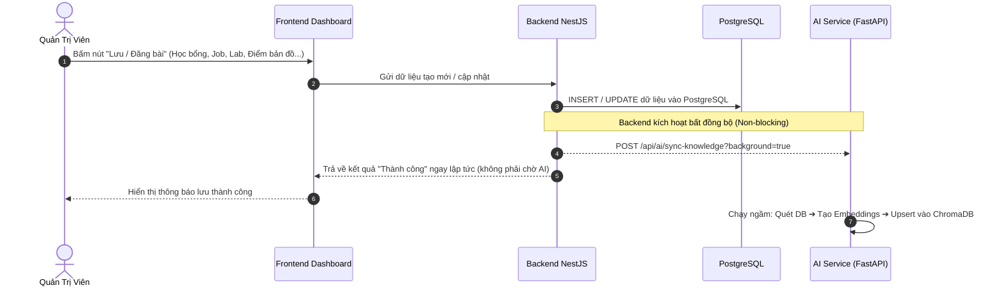
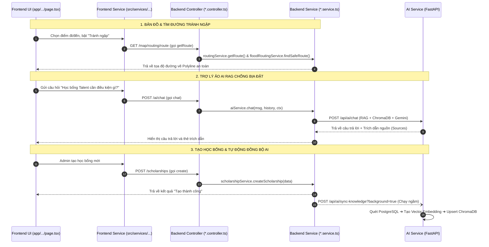

# EduMap: Tài Liệu Toàn Diện Về Kiến Trúc Hệ Thống & Ánh Xạ Liên Kết Frontend - Backend - AI

---

## MỤC LỤC
1. [Tổng quan Hệ sinh thái EduMap](#1-tổng-quan-hệ-sinh-thái-edumap)
2. [Hệ thống AI Service & Cơ chế RAG Hai Tầng](#2-hệ-thống-ai-service--cơ-chế-rag-hai-tầng)
   - 2.1. Điểm khởi chạy `main.py` & Cơ chế Báo trạng thái (Không dùng Mock)
   - 2.2. Cơ chế Đồng bộ Vector Database (`seed_vector_db.py` & `vector_store.py`)
   - 2.3. Kiến trúc RAG 2 Tầng (Hybrid Dynamic RAG)
   - 2.4. Tại sao EduMap dùng Cloud Foundation Model (.py) thay vì đóng gói file Model (.pt/.bin)
3. [Tự động hóa Đồng bộ Tri thức (Admin 1 Nút)](#3-tự-động-hóa-đồng-bộ-tri-thức-admin-1-nút)
4. [Cấu trúc Thư mục & Bảng Danh mục File Backend (`/backend`)](#4-cấu-trúc-thư-mục--bảng-danh-mục-file-backend-backend)
5. [Cấu trúc Thư mục & Bảng Danh mục File Frontend (`/frontend`)](#5-cấu-trúc-thư-mục--bảng-danh-mục-file-frontend-frontend)
6. [Sơ đồ Quan hệ & Bảng Ánh xạ Chi tiết: Frontend ➔ Backend (Kèm Tên Hàm)](#6-sơ-đồ-quan-hệ--bảng-ánh-xạ-chi-tiết-frontend--backend-kèm-tên-hàm)

---

## 1. Tổng quan Hệ sinh thái EduMap

EduMap là nền tảng bản đồ giáo dục thông minh (Smart Education Map Platform) dành cho sinh viên và giảng viên Trường Đại học Công nghệ Đồng Nai (DNTU). Hệ thống gồm 3 tầng kiến trúc phân tán:

```
┌────────────────────────────────────────────────────────┐
│            FRONTEND (Next.js 14 App Router)            │
│       PWA • Leaflet GIS • Tailwind CSS • Sentry        │
└───────────────────────────┬────────────────────────────┘
                            │ HTTP / WebSocket (Socket.io)
┌───────────────────────────▼────────────────────────────┐
│              BACKEND CORE (NestJS REST API)            │
│   39 Modules • TypeORM • Redis Cache • MinIO S3 Storage │
└─────────────┬────────────────────────────┬─────────────┘
              │ PostgreSQL + PostGIS       │ Internal HTTP
┌─────────────▼──────────────┐ ┌───────────▼─────────────┐
│    DATABASE POSTGRESQL     │ │   AI SERVICE (FastAPI)  │
│  Bản đồ GIS • Nghiệp vụ    │ │ RAG • Gemini • ChromaDB │
└────────────────────────────┘ └─────────────────────────┘
```

---

## 2. Hệ thống AI Service & Cơ chế RAG Hai Tầng

### 2.1. Điểm khởi chạy `main.py` & Cơ chế Báo trạng thái (Không dùng Mock)
- File `ai-service/main.py` đóng vai trò là **Entry Point** chính của dịch vụ FastAPI.
- **Loại bỏ hoàn toàn Mock**: Gỡ bỏ các class giả lập (`MockLLMService`, `MockDBService`). Khi service thiếu API key hoặc lỗi, hệ thống trả về mã trạng thái HTTP chuẩn xác:
  - **`503 Service Unavailable`**: Khi chưa cấu hình `GEMINI_API_KEY` hoặc AI Service chưa sẵn sàng.
  - **`502 Bad Gateway`**: Khi quá trình sinh nội dung gặp lỗi từ phía LLM/Database.
- **Endpoint Quản trị & Đồng bộ**: Cung cấp `POST /api/ai/sync-knowledge` hỗ trợ cả chế độ đồng bộ trực tiếp (`background=false`) và đồng bộ ngầm (`background=true`).
- **Health Check & Metrics**: Endpoint `/health` trả về trạng thái chi tiết của cả `ai_ready` và `db_ready`; `/metrics` phục vụ giám sát Prometheus.

### 2.2. Cơ chế Đồng bộ Vector Database (`seed_vector_db.py` & `vector_store.py`)
- **Tự động đọc dữ liệu thật từ PostgreSQL**: Script kết nối linh hoạt vào PostgreSQL (hỗ trợ cả trong mạng container Docker và ngoài host qua cổng `5433`/`5432`), truy vấn trực tiếp các bảng nghiệp vụ:
  - `scholarships`: Học bổng, điều kiện xét tuyển, giá trị, hạn nộp.
  - `stem_labs`: Phòng lab STEM, thiết bị Robotics/In 3D, quy chế, giờ mở cửa.
  - `career_paths`: Lộ trình nghề nghiệp, mức lương tham khảo, kỹ năng yêu cầu.
  - `wifi_locations`: Điểm truy cập Wi-Fi công cộng, tốc độ mạng, hướng dẫn kết nối.
  - `locations`: Cơ sở vật chất, trường học, thư viện, công viên.
  - `learning_materials`: Tài liệu học tập, giáo trình số.
- **Chuyển đổi thành Narrative Text**: Tự động ghép nối các cột dữ liệu rời rạc thành các đoạn văn bản tự nhiên có ngữ cảnh hoàn chỉnh để AI hiểu sâu sắc.
- **Chế độ Fallback thông minh**: Nếu database tạm thời bảo trì hoặc chưa có dữ liệu, script tự động nạp bộ tri thức cốt lõi nền tảng về trường DNTU & EduMap để hệ thống không bị gián đoạn.
- **Cơ chế Upsert chống trùng lặp**: Trong `vector_store.py`, hàm `add_documents` sử dụng `collection.upsert(...)` của ChromaDB, cho phép chạy đồng bộ nhiều lần mà không gặp lỗi trùng ID.

### 2.3. Kiến trúc RAG 2 Tầng (Hybrid Dynamic RAG)

EduMap kết hợp đồng thời 2 tầng ngữ cảnh để đảm bảo câu trả lời luôn mới nhất và chính xác nhất:

1. **Tầng 1 (Ngữ cảnh Động Thời gian thực - Backend NestJS `ai.service.ts`)**:
   - Khi có tin nhắn từ người dùng, Backend truy vấn nhanh dữ liệu "nóng" nhất trong PostgreSQL: các sách/tài liệu được xem nhiều nhất và các địa điểm giáo dục đang hoạt động.
   - Đóng gói thành `systemContext` gửi kèm sang AI Service.
2. **Tầng 2 (Truy xuất Ngữ nghĩa Chuyên sâu - AI Service `llm_service.py` & `vector_store.py`)**:
   - Tính toán vector embedding của câu hỏi người dùng qua Google Gemini Embedding (`gemini-embedding-001` / `text-embedding-004`).
   - Tìm kiếm top 3 đoạn tài liệu khớp nhất trong ChromaDB (`edumap_docs`).
3. **Quy tắc Chống Bịa Đặt (Zero Hallucination)**:
   - System instruction bắt buộc: Tuyệt đối không tự suy diễn nếu thông tin không có trong tài liệu cung cấp.
   - Trả về mảng `sources` chứa `doc_id`, `title`, `snippet` để giao diện hiển thị thẻ trích dẫn nguồn.
4. **Bộ nhớ hội thoại & Tối ưu hiệu năng**:
   - Duy trì 6 tin nhắn gần nhất (`history[-6:]`) cho hội thoại đa lượt (multi-turn).
   - Tầng đệm Redis Cache lưu kết quả trong vòng 1 giờ (TTL 3600s), giảm thiểu chi phí API.
   - Hỗ trợ Streaming Token qua Server-Sent Events (SSE) tại `/api/ai/chat/stream`.

### 2.4. Tại sao EduMap dùng Cloud Foundation Model (.py) thay vì đóng gói file Model (.pt/.bin)

| Tiêu chí | Mô hình đóng gói Local (.pt, .bin, .onnx) | Cloud Foundation Model (EduMap - .py) |
| :--- | :--- | :--- |
| **Độ thông minh** | Bị giới hạn bởi khả năng tính toán của server nội bộ. | **Cực cao**: Sử dụng sức mạnh siêu mô hình Google Gemini 3.8 Flash với hàng trăm tỷ tham số. |
| **Phần cứng yêu cầu** | Bắt buộc có card đồ họa GPU chuyên dụng (VRAM 16GB - 80GB), RAM lớn. | **Máy tính bình thường / VPS giá rẻ** không có GPU vẫn chạy mượt mà. |
| **Dung lượng dự án** | Rất nặng (từ 2GB đến hơn 50GB file weights). | **Cực nhẹ** (chỉ vài Megabytes mã nguồn Python điều phối). |
| **Bảo trì / Nâng cấp** | Phải huấn luyện lại (fine-tuning) rất tốn kém và phức tạp. | Chỉ cần thay đổi tên mô hình trong file `.env`. |

---

## 3. Tự động hóa Đồng bộ Tri thức (Admin 1 Nút)

Hệ thống đã loại bỏ việc Admin phải chạy lệnh tay hoặc bấm thêm nút phụ:



---

## 4. Cấu trúc Thư mục & Bảng Danh mục File Backend (`/backend`)

### 4.1. Thư mục Gốc & Vận hành

#### Folder: `/backend`
| File | Chức năng chi tiết |
| :--- | :--- |
| `Dockerfile` | Hướng dẫn đóng gói và triển khai ứng dụng NestJS Backend lên container Docker. |
| `Dockerfile.hf` | Cấu hình Dockerfile tối ưu triển khai Backend lên Hugging Face Spaces. |
| `package.json` | Khai báo toàn bộ thư viện dependencies, scripts thực thi và thông tin dự án. |
| `package-lock.json` | Khóa phiên bản chi tiết của các packages phụ thuộc. |
| `tsconfig.json` | Cấu hình trình biên dịch TypeScript (target ES2021, moduleResolution node...). |

#### Folder: `/backend/scripts`
| File | Chức năng chi tiết |
| :--- | :--- |
| `start-prod.sh` | Shell script chạy migration database và kích hoạt server ở chế độ Production. |

#### Folder: `/backend/test`
| File | Chức năng chi tiết |
| :--- | :--- |
| `app.e2e-spec.ts` | File kiểm thử đầu cuối (End-to-End Test) kiểm tra trạng thái hoạt động của server. |

#### Folder: `/backend/src`
| File | Chức năng chi tiết |
| :--- | :--- |
| `main.ts` | Điểm khởi động server NestJS: thiết lập CORS, Swagger OpenAPI, ValidationPipe toàn cục, WebSocket adapter, cổng port (3000/3002). |
| `app.module.ts` | Module gốc (Root Module) nạp cấu hình TypeORM, Redis, ConfigModule và khai báo toàn bộ 39 module nghiệp vụ. |

---

### 4.2. Thư mục Cấu hình & Cơ sở dữ liệu

#### Folder: `/backend/src/config`
| File | Chức năng chi tiết |
| :--- | :--- |
| `data-source.ts` | Khởi tạo kết nối TypeORM DataSource cho phép chạy lệnh CLI TypeORM Migration. |
| `firebase.config.ts` | Cấu hình Firebase Admin SDK phục vụ gửi Push Notifications đến thiết bị di động. |
| `minio.config.ts` | Cấu hình kết nối S3 MinIO Client để upload/download file, ảnh đại diện, tài liệu. |
| `multer.config.ts` | Cấu hình bộ lọc tệp tải lên (giới hạn dung lượng, định dạng file cho phép: png, jpg, pdf...). |
| `optimize_indexes.sql` | Script SQL tối ưu chỉ mục (Indexes GIST, B-Tree) trên PostgreSQL cho các bảng dữ liệu lớn. |

#### Folder: `/backend/src/database`
| File | Chức năng chi tiết |
| :--- | :--- |
| `schema.sql` | Bản thiết kế hoàn chỉnh gồm định nghĩa tất cả các bảng (DDL), khoá chính, khoá ngoại, kiểu dữ liệu hình học PostGIS. |
| `create-tables.sql` | Script phụ trợ tạo nhanh các bảng cơ bản. |
| `phase1_updates.sql` | Script SQL cập nhật cấu trúc cơ sở dữ liệu cho giai đoạn 1 của dự án. |
| `seed-base.sql` | Dữ liệu khởi tạo nền tảng ban đầu (Roles, Permissions, danh mục địa điểm). |
| `seed.sql` | Dữ liệu mẫu phong phú gồm danh sách người dùng, trường học, tài liệu, học bổng, sự kiện. |
| `seed-db.ts` | Script TypeScript dùng để thực thi nạp dữ liệu seed tự động thông qua TypeORM. |

---

### 4.3. Thư mục Thành phần Dùng chung (`/backend/src/common`)

#### Folder: `/backend/src/common/decorators`
| File | Chức năng chi tiết |
| :--- | :--- |
| `public.decorator.ts` | Decorator `@Public()` đánh dấu endpoint không cần xác thực JWT token (cho phép truy cập tự do). |

#### Folder: `/backend/src/common/filters`
| File | Chức năng chi tiết |
| :--- | :--- |
| `all-exceptions.filter.ts` | Bắt mọi ngoại lệ chưa được xử lý trong ứng dụng, chuẩn hóa định dạng JSON lỗi trả về client. |
| `http-exception.filter.ts` | Xử lý và định dạng các lỗi HTTP chuẩn (400, 401, 403, 404, 500). |

#### Folder: `/backend/src/common/interceptors`
| File | Chức năng chi tiết |
| :--- | :--- |
| `logging.interceptor.ts` | Ghi nhận thời gian xử lý và log thông tin của từng request/response. |
| `response.interceptor.ts` | Chuẩn hóa cấu trúc dữ liệu trả về cho client theo dạng `{ success: true, data: ..., timestamp: ... }`. |

#### Folder: `/backend/src/common/middleware`
| File | Chức năng chi tiết |
| :--- | :--- |
| `request-logging.middleware.ts` | Middleware ghi log IP, User-Agent và Method của mọi yêu cầu gửi đến server. |

#### Folder: `/backend/src/common/pipes`
| File | Chức năng chi tiết |
| :--- | :--- |
| `validation.pipe.ts` | Pipe kiểm tra tính hợp lệ của dữ liệu đầu vào dựa trên `class-validator`. |

#### Folder: `/backend/src/common/adapters`
| File | Chức năng chi tiết |
| :--- | :--- |
| `redis-io.adapter.ts` | Adapter kết nối WebSocket Socket.IO với Redis Pub/Sub phục vụ realtime trên nhiều node server. |

#### Folder: `/backend/src/common/exceptions`
| File | Chức năng chi tiết |
| :--- | :--- |
| `business-exception.ts` | Định nghĩa lớp ngoại lệ nghiệp vụ tùy chỉnh dành riêng cho các quy tắc của EduMap. |

#### Folder: `/backend/src/services`
| File | Chức năng chi tiết |
| :--- | :--- |
| `google-ai.service.ts` | Service dự phòng gọi trực tiếp Google Generative AI (Gemini) từ phía backend NodeJS. |

---

### 4.4. Thư mục Các Module Nghiệp vụ (`/backend/src/modules`)

#### Folder: `/backend/src/modules/auth` (Xác thực & Người dùng)
| File | Chức năng chi tiết |
| :--- | :--- |
| `auth.module.ts` | Cấu hình Passport, JWT Module và nạp các Entity liên quan đến người dùng. |
| `auth.controller.ts` | Các endpoint đăng ký, đăng nhập, đổi mật khẩu, refresh token, xác thực 2FA. |
| `auth.service.ts` | Xử lý mã hóa mật khẩu (bcrypt), sinh JWT Token, xác thực thông tin tài khoản. |
| `mfa.service.ts` | Xử lý xác thực đa yếu tố (2FA / Multi-Factor Authentication) qua mã OTP / Authenticator. |
| `role-assignment.service.ts` | Logic gán quyền và vai trò linh hoạt cho từng tài khoản người dùng. |
| `index.ts` | File export tập trung các thành phần của module Auth. |
| `guards/jwt-auth.guard.ts` | Guard bảo vệ API bằng JWT Token. |
| `guards/roles.guard.ts` | Guard kiểm tra phân quyền người dùng (Role-based Access Control). |
| `strategies/jwt.strategy.ts` | Chiến lược giải mã và xác minh JWT Token của thư viện Passport. |
| `decorators/roles.decorator.ts` | Decorator `@Roles()` chỉ định các vai trò được phép gọi endpoint. |
| `dto/login.dto.ts` | DTO dữ liệu đăng nhập (email, password). |
| `dto/register.dto.ts` | DTO dữ liệu đăng ký (email, password, full_name, role). |
| `dto/request-password-reset.dto.ts` | DTO yêu cầu gửi mã khôi phục mật khẩu qua email. |
| `dto/reset-password.dto.ts` | DTO thiết lập lại mật khẩu mới kèm token xác thực. |
| `dto/enable-2fa.dto.ts` | DTO kích hoạt bảo mật 2 lớp. |
| `dto/verify-2fa.dto.ts` | DTO kiểm tra mã xác thực 2 lớp OTP. |
| `dto/update-profile.dto.ts` | DTO cập nhật hồ sơ cá nhân sinh viên. |
| `dto/update-preferences.dto.ts` | DTO cập nhật tùy chọn người dùng (thông báo, giao diện). |
| `dto/refresh-token.dto.ts` | DTO cấp mới access token từ refresh token. |
| `entities/user.entity.ts` | Thực thể bảng người dùng (`users`), liên kết vai trò và trạng thái tài khoản. |
| `entities/audit-log.entity.ts` | Thực thể bảng nhật ký kiểm toán hành vi người dùng. |
| `entities/password-reset-token.entity.ts`| Bảng lưu trữ token khôi phục mật khẩu có thời hạn. |
| `entities/notification.entity.ts` | Bảng lưu thông báo gửi đến người dùng. |
| `entities/support-ticket.entity.ts` | Bảng tiếp nhận và xử lý yêu cầu hỗ trợ kỹ thuật của sinh viên. |
| `entities/user-preference.entity.ts` | Bảng lưu tùy biến giao diện và cài đặt thông báo của người dùng. |

#### Folder: `/backend/src/modules/ai` (Trợ lý AI & RAG)
| File | Chức năng chi tiết |
| :--- | :--- |
| `ai.module.ts` | Cấu hình HttpModule giao tiếp với AI Service (FastAPI) và nạp ChatHistory entity. |
| `ai.controller.ts` | Endpoint Chatbot AI RAG (`/ai/chat`), tìm kiếm (`/ai/search`), lộ trình học (`/ai/learning-path`), kích hoạt đồng bộ (`/ai/sync-knowledge`). |
| `ai.service.ts` | Thu thập ngữ cảnh thời gian thực từ PostgreSQL, gửi request sang AI Service, lưu lịch sử chat, kích hoạt đồng bộ Vector Store. |
| `dto/chat.dto.ts` | Định dạng dữ liệu tin nhắn chat gửi lên từ người dùng. |
| `entities/chat-history.entity.ts` | Bảng lưu lịch sử hội thoại hỏi - đáp kèm nguồn trích dẫn. |
| `entities/education-stat.entity.ts` | Bảng thống kê giáo dục phục vụ phân tích dự báo. |

#### Folder: `/backend/src/modules/map` (Bản đồ GIS & Dẫn đường)
| File | Chức năng chi tiết |
| :--- | :--- |
| `map.module.ts` | Quản lý module bản đồ, nạp TypeORM các thực thể PostGIS. |
| `map.controller.ts` | API truy vấn địa điểm, thêm điểm bản đồ, tìm kiếm địa điểm xung quanh qua toạ độ GPS. |
| `map.service.ts` | Xử lý không gian GIS (ST_DWithin, ST_Distance), lưu điểm bản đồ và tự động thông báo đồng bộ AI. |
| `map.gateway.ts` | WebSocket Gateway cập nhật vị trí thời gian thực và thông báo bản đồ. |
| `routing.controller.ts` | API định tuyến, tìm đường đi tối ưu cho sinh viên. |
| `routing.service.ts` | Kết nối máy chủ định tuyến OSRM để tính toán đường đi ngắn nhất giữa 2 toạ độ. |
| `flood-routing.service.ts` | Tính toán lộ trình thông minh tránh các điểm ngập nước tại TP. Biên Hòa khi trời mưa. |
| `traffic-routing.service.ts` | Định tuyến tránh các điểm ùn tắc giao thông giờ cao điểm. |
| `index.ts` | File export tập trung của module Map. |
| `dto/map-point.dto.ts` | DTO dữ liệu tạo điểm bản đồ mới kèm toạ độ GPS. |
| `dto/location.dto.ts` | DTO truy vấn địa điểm theo bounding box. |
| `dto/ai-analysis.dto.ts` | DTO gửi yêu cầu phân tích mật độ địa điểm qua AI. |
| `entities/map-point.entity.ts` | Thực thể bảng điểm bản đồ lưu trữ kiểu dữ liệu Geography PostGIS. |
| `entities/location.entity.ts` | Thực thể bảng địa điểm trường học, tiện ích giáo dục. |
| `entities/location-category.entity.ts` | Thực thể danh mục phân loại địa điểm (Trường học, Thư viện, Ký túc xá...). |
| `entities/flood-zone.entity.ts` | Thực thể lưu trữ các vùng trũng ngập nước khi mưa lớn tại Biên Hòa. |
| `entities/traffic-segment.entity.ts` | Thực thể lưu trữ các đoạn đường có lưu lượng giao thông đông đúc. |
| `entities/educational-point.entity.ts` | Thực thể chi tiết các điểm phục vụ học tập nghiên cứu. |

#### Folder: `/backend/src/modules/scholar` (Học bổng)
| File | Chức năng chi tiết |
| :--- | :--- |
| `scholarship.module.ts` | Khai báo module học bổng, tích hợp NotificationsModule và AIModule. |
| `scholarship.controller.ts` | API lấy danh sách học bổng, nộp hồ sơ, kiểm tra điều kiện, tạo và sửa học bổng. |
| `scholarship.service.ts` | Quản lý học bổng, AI phân tích điều kiện ứng tuyển (`checkEligibility`), tự động kích hoạt đồng bộ AI khi thêm/sửa học bổng. |
| `dto/apply-scholarship.dto.ts` | DTO nộp đơn xin học bổng (CV URL, thư nguyện vọng). |
| `entities/scholarship.entity.ts` | Thực thể bảng học bổng (`scholarships`), tiêu chí xét tuyển, giá trị học bổng. |
| `entities/scholarship-application.entity.ts` | Thực thể bảng đơn nộp xin xét duyệt học bổng của sinh viên. |

#### Folder: `/backend/src/modules/career` (Hướng nghiệp & Việc làm)
| File | Chức năng chi tiết |
| :--- | :--- |
| `career.module.ts` | Cấu hình module định hướng nghề nghiệp và việc làm. |
| `career.controller.ts` | API lộ trình nghề nghiệp, tìm kiếm việc làm, đăng ký ứng tuyển, tư vấn nghề nghiệp AI. |
| `career.service.ts` | Logic lộ trình nghề nghiệp, kỹ năng cần có, kết nối Gemini AI tư vấn nghề nghiệp, tự động đồng bộ sang AI khi thêm lộ trình/job. |
| `dto/create-job.dto.ts` | DTO đăng tin tuyển dụng việc làm mới. |
| `dto/update-job.dto.ts` | DTO chỉnh sửa thông tin việc làm. |
| `dto/apply-job.dto.ts` | DTO nộp hồ sơ ứng tuyển việc làm. |
| `dto/create-user-career.dto.ts` | DTO thiết lập mục tiêu nghề nghiệp cá nhân. |
| `dto/update-user-career.dto.ts` | DTO cập nhật mục tiêu nghề nghiệp. |
| `dto/create-user-skill.dto.ts` | DTO khai báo kỹ năng cá nhân sinh viên đã tích lũy. |
| `dto/update-user-skill.dto.ts` | DTO cập nhật mức độ thành thạo kỹ năng. |
| `entities/career.entity.ts` | Thực thể bảng lộ trình nghề nghiệp (`career_paths`). |
| `entities/job.entity.ts` | Thực thể bảng tin tuyển dụng việc làm (`jobs`). |
| `entities/user-career.entity.ts` | Thực thể bảng mục tiêu nghề nghiệp của người dùng. |
| `entities/user-skill.entity.ts` | Thực thể bảng kỹ năng của từng sinh viên. |
| `entities/application.entity.ts` | Thực thể bảng đơn ứng tuyển việc làm. |

#### Folder: `/backend/src/modules/stem` (Sân chơi STEM Lab)
| File | Chức năng chi tiết |
| :--- | :--- |
| `stem.module.ts` | Module quản lý sân chơi và cơ sở vật chất STEM, tích hợp AIModule. |
| `stem.controller.ts` | API xem danh sách lab, tìm lab gần nhất, đăng ký lab mới, đặt lịch mượn máy in 3D/Robotics. |
| `stem.service.ts` | Quản lý thiết bị lab, đặt lịch chống trùng thời gian, tự động đồng bộ thông tin lab sang AI. |
| `dto/create-lab.dto.ts` | DTO đăng ký thông tin phòng lab STEM mới. |
| `entities/stem.entity.ts` | Thực thể bảng phòng lab STEM (`stem_labs`), thiết bị, quy chế và sức chứa. |

#### Folder: `/backend/src/modules/library` (Thư viện số & Tài liệu)
| File | Chức năng chi tiết |
| :--- | :--- |
| `library.module.ts` | Module thư viện số và tài liệu học tập. |
| `library.controller.ts` | API tìm kiếm sách, tài liệu học tập, xem chi tiết và tải tài liệu. |
| `library.service.ts` | Xử lý truy vấn tài liệu, đếm lượt xem, theo dõi tiến độ đọc của sinh viên. |
| `index.ts` | File export của module thư viện. |
| `dto/create-resource.dto.ts` | DTO thêm mới sách, tài liệu học tập số. |
| `entities/learning-material.entity.ts` | Bảng tài liệu học tập (`learning_materials`), tác giả, tóm tắt. |
| `entities/user-learning-history.entity.ts`| Bảng lịch sử đọc tài liệu của người dùng. |

#### Folder: `/backend/src/modules/mentor` (Kết nối Cố vấn)
| File | Chức năng chi tiết |
| :--- | :--- |
| `mentor.module.ts` | Module hỗ trợ ghép nối sinh viên với cố vấn / mentor. |
| `mentor.controller.ts` | API xem danh sách mentor, lịch trống, đặt lịch hẹn tư vấn (1-on-1). |
| `mentor.service.ts` | Quản lý khung giờ rảnh, duyệt buổi hẹn, tạo phòng tư vấn. |
| `dto/book-mentor.dto.ts` | DTO đặt lịch hẹn cố vấn kèm ghi chú vấn đề cần hỏi. |
| `entities/mentor.entity.ts` | Thực thể hồ sơ thông tin cố vấn (`mentors`). |
| `entities/mentor-availability.entity.ts` | Bảng lưu các khung giờ rảnh của mentor trong tuần. |
| `entities/mentor-session.entity.ts` | Bảng thông tin buổi gặp gỡ tư vấn trực tuyến. |
| `entities/mentor-relationship.entity.ts` | Bảng quan hệ đồng hành giữa cố vấn và sinh viên. |

#### Folder: `/backend/src/modules/crawler` (Thu thập Dữ liệu)
| File | Chức năng chi tiết |
| :--- | :--- |
| `crawler.module.ts` | Module cào dữ liệu bản đồ OpenStreetMap và dữ liệu mở. |
| `crawler.controller.ts` | Endpoint kích hoạt cào dữ liệu thủ công từ Dashboard Admin. |
| `crawler.service.ts` | Cronjob tự động cào các quán cafe học tập, nhà sách, công viên quanh DNTU lưu vào DB dưới dạng chờ duyệt. |

#### Folder: `/backend/src/modules/admin` (Quản trị Hệ thống)
| File | Chức năng chi tiết |
| :--- | :--- |
| `admin.module.ts` | Module phân quyền quản trị Admin / Moderator. |
| `admin.controller.ts` | API Dashboard thống kê, quản lý người dùng, ban/unban tài khoản, kích hoạt crawler. |
| `admin.service.ts` | Tính toán số liệu tổng quan hệ thống, kiểm soát tài khoản người dùng. |
| `backup.service.ts` | Dịch vụ tự động sao lưu dự phòng cơ sở dữ liệu PostgreSQL. |
| `dto/user-query.dto.ts` | DTO tìm kiếm và lọc danh sách tài khoản người dùng. |
| `dto/update-user-status.dto.ts` | DTO khóa (ban) hoặc kích hoạt lại tài khoản người dùng. |
| `entities/admin-stats.entity.ts` | Bảng lưu trữ chỉ số thống kê hệ thống theo ngày. |
| `entities/crawl-history.entity.ts` | Bảng ghi nhật ký các lần chạy cào dữ liệu. |
| `entities/user-management.entity.ts` | Bảng cấu hình quản lý người dùng nâng cao. |

#### Folder: `/backend/src/modules/green` (Sống Xanh)
| File | Chức năng chi tiết |
| :--- | :--- |
| `green.module.ts` | Module chiến dịch Sống Xanh (Green Living). |
| `green.controller.ts` | API ghi nhận hành động bảo vệ môi trường (đi xe đạp, tiết kiệm điện, nhặt rác). |
| `green.service.ts` | Tính toán chỉ số giảm phát thải CO2 và cộng điểm Eco-Point cho sinh viên. |
| `index.ts` | File export của module Green. |
| `dto/create-impact.dto.ts` | DTO báo cáo hoạt động sống xanh kèm hình ảnh minh chứng. |
| `entities/green.entity.ts` | Bảng lưu hoạt động sống xanh của sinh viên. |

#### Folder: `/backend/src/modules/gamification` (Điểm thưởng & Huy hiệu)
| File | Chức năng chi tiết |
| :--- | :--- |
| `gamification.module.ts` | Module trò chơi hoá (Gamification). |
| `gamification.controller.ts` | API bảng xếp hạng (Leaderboard), danh sách huy hiệu đạt được, đổi điểm thưởng. |
| `gamification.service.ts` | Logic trao huy hiệu (Badges), cộng điểm kinh nghiệm (XP) khi hoàn thành hoạt động. |
| `index.ts` | File export tập trung của module Gamification. |
| `dto/grant-points.dto.ts` | DTO cộng điểm thưởng cho sinh viên. |
| `entities/gamification.entity.ts` | Bảng quản lý huy hiệu và bảng xếp hạng thành tích sinh viên. |
| `entities/green-activity.entity.ts` | Bảng ghi nhận điểm cộng từ các hoạt động bảo vệ môi trường. |

#### Folder: `/backend/src/modules/notifications` (Thông báo Đa kênh)
| File | Chức năng chi tiết |
| :--- | :--- |
| `notifications.module.ts` | Cấu hình gửi thông báo In-app, Email, Push Notifications. |
| `notifications.controller.ts` | API lấy danh sách thông báo, đánh dấu đã đọc. |
| `notifications.service.ts` | Logic tạo và gửi thông báo cho sinh viên khi có kết quả học bổng, sự kiện mới. |
| `notification.gateway.ts` | WebSocket Gateway bắn thông báo real-time lên màn hình người dùng tức thì. |
| `index.ts` | File export module Notifications. |

#### Folder: `/backend/src/modules/donate` (Quyên góp & Từ thiện)
| File | Chức năng chi tiết |
| :--- | :--- |
| `donate.module.ts` | Cấu hình module quyên góp, tích hợp cổng thanh toán VNPay. |
| `donate.controller.ts` | API tạo chiến dịch quyên góp sách/học bổng, nộp tiền quyên góp. |
| `donate.service.ts` | Quản lý chiến dịch, thống kê tổng số tiền gây quỹ ủng hộ sinh viên khó khăn. |
| `vnpay.service.ts` | Tạo URL thanh toán VNPay, xác thực chữ ký bảo mật (checksum) khi thanh toán thành công. |
| `dto/...` & `entities/...` | DTO tạo chiến dịch và thực thể bảng lưu thông tin đóng góp từ thiện. |

#### Folder: `/backend/src/modules/certificate` & `blockchain` (Chứng chỉ Số)
| File | Chức năng chi tiết |
| :--- | :--- |
| `certificate.module.ts` / `controller.ts` / `service.ts` | Quản lý, cấp phát chứng chỉ số cho sinh viên hoàn thành khóa học, hoạt động ngoại khóa. |
| `blockchain.module.ts` / `controller.ts` / `service.ts` | Ghi nhận mã băm (hash) và xác thực tính vẹn toàn của chứng chỉ chống làm giả. |

#### Folder: `/backend/src/modules/wifi` (Điểm Wi-Fi Miễn phí)
| File | Chức năng chi tiết |
| :--- | :--- |
| `wifi.module.ts` / `controller.ts` / `service.ts` | Quản lý toạ độ các điểm truy cập Wi-Fi công cộng miễn phí quanh trường và TP. Biên Hòa. |

#### Folder: `/backend/src/modules/events` (Sự kiện & Hội thảo)
| File | Chức năng chi tiết |
| :--- | :--- |
| `events.module.ts` / `controller.ts` / `service.ts` | Quản lý tổ chức sự kiện, đăng ký tham gia (RSVP) và điểm danh sinh viên. |

#### Folder: `/backend/src/modules/storage` (Kho Lưu trữ MinIO S3)
| File | Chức năng chi tiết |
| :--- | :--- |
| `storage.module.ts` / `controller.ts` / `service.ts` | Tiếp nhận tải lên file (ảnh đại diện, CV, tài liệu PDF) đẩy lên cụm MinIO S3. |

#### Folder: `/backend/src/modules/community` (Diễn đàn Sinh viên)
| File | Chức năng chi tiết |
| :--- | :--- |
| `community.module.ts` / `controller.ts` / `service.ts` | Bảng tin sinh viên đăng bài viết, tương tác thích, bình luận và chia sẻ kiến thức. |

#### Folder: `/backend/src/modules/share` (Chia sẻ Đồ dùng & Sách)
| File | Chức năng chi tiết |
| :--- | :--- |
| `share.module.ts` / `controller.ts` / `service.ts` | Quản lý hoạt động cho mượn - chia sẻ giáo trình cũ và thiết bị học tập. |
| `sanitize.service.ts` | Lọc mã độc và ký tự đặc biệt nguy hiểm trong nội dung bài đăng mượn đồ. |

#### Các Module Bổ trợ Khác:
- **`hackathon/`**: Quản lý cuộc thi sáng tạo công nghệ sinh viên.
- **`volunteer/`**: Quản lý chiến dịch thiện nguyện và giờ rèn luyện.
- **`internship/`**: Kết nối cơ hội thực tập tại các doanh nghiệp đối tác.
- **`survey/`**: Khảo sát ý kiến đánh giá chất lượng đào tạo.
- **`hs-connection/`**: Tư vấn tuyển sinh và kết nối học sinh THPT.
- **`intl/`**: Chương trình trao đổi sinh viên quốc tế.
- **`summer/`**: Chiến dịch hoạt động và trại hè thanh niên.
- **`business/`**: Quản trị danh bạ đối tác doanh nghiệp đồng hành.
- **`learning-community/`**: Quản lý điểm hẹn học tập và quán cafe sinh viên.
- **`role/`**: Quản trị ma trận phân quyền chi tiết Role-Permission.
- **`audit-log/`**: Ghi nhận lịch sử kiểm toán các thao tác nhạy cảm.
- **`analytics/`**: Tổng hợp dữ liệu biểu đồ phân tích tăng trưởng.
- **`dashboard/`**: Tổng hợp số liệu thống kê nhanh trên bảng tin.
- **`payment/`**: Xử lý giao dịch thanh toán đơn hàng.
- **`opportunity/`**: Quản lý cơ hội nghiên cứu khoa học.
- **`mobile-config/`**: Cung cấp cấu hình giao diện động cho app Mobile.
- **`module/` & `feature/`**: Quản trị bật/tắt tính năng (Feature Flags).

---

## 5. Cấu trúc Thư mục & Bảng Danh mục File Frontend (`/frontend`)

### 5.1. Thư mục Gốc & Cấu hình

#### Folder: `/frontend`
| File | Chức năng chi tiết |
| :--- | :--- |
| `package.json` | Danh sách thư viện giao diện, script chạy (`dev`, `build`, `start`, `lint`). |
| `package-lock.json` | Khóa phiên bản chi tiết của cây dependencies. |
| `tsconfig.json` | Cấu hình trình biên dịch TypeScript và alias đường dẫn `@/*`. |
| `tsconfig.tsbuildinfo` | File cache tăng tốc biên dịch TypeScript. |
| `next.config.js` | Cấu hình Next.js (PWA, API rewrites, domain ảnh, Sentry Webpack). |
| `next.config.mjs` | Cấu hình Next.js dạng ES Module dự phòng. |
| `next-env.d.ts` | File khai báo kiểu tự động của Next.js cho TypeScript. |
| `tailwind.config.ts` | Cấu hình hệ thống thiết kế Tailwind CSS (màu sắc, fonts, breakpoints). |
| `postcss.config.js` | Cấu hình PostCSS để xử lý Tailwind CSS. |
| `sentry.client.config.ts` | Cấu hình Sentry bắt lỗi phía Client trình duyệt. |
| `sentry.server.config.ts` | Cấu hình Sentry bắt lỗi phía Node.js Server của Next.js. |
| `sentry.edge.config.ts` | Cấu hình Sentry cho môi trường Edge Runtime. |
| `Dockerfile` | Hướng dẫn build image Docker đa tầng tối ưu dung lượng khi deploy. |
| `Dockerfile.hf` | Dockerfile tối ưu triển khai Frontend lên Hugging Face Spaces. |
| `README.md` | Tài liệu hướng dẫn cài đặt và khởi chạy Frontend. |

---

### 5.2. Thư mục Tiện ích & Hỗ trợ (`/frontend/lib` & `/frontend/src`)

#### Folder: `/frontend/lib`
| File | Chức năng chi tiết |
| :--- | :--- |
| `utils.ts` | Hàm tiện ích gộp class CSS (`cn`), định dạng tiền tệ, ngày tháng. |
| `theme.ts` | Quản lý chế độ sáng/tối (Dark/Light mode). |
| `responsive.ts` | Hook kiểm tra kích thước màn hình thiết bị (Mobile, Tablet, Desktop). |
| `logger.ts` | Module ghi log Client có gắn thẻ mức độ (INFO, WARN, ERROR). |
| `accessibility.ts` | Tiện ích hỗ trợ khả năng tiếp cận (a11y) cho người khiếm thị. |

#### Folder: `/frontend/lib/i18n`
| File | Chức năng chi tiết |
| :--- | :--- |
| `LanguageContext.tsx` | React Context Provider cung cấp hàm đổi ngôn ngữ (Tiếng Việt `vi` / Tiếng Anh `en`). |
| `translations.ts` | Từ điển chứa toàn bộ chuỗi văn bản giao diện song ngữ. |

#### Folder: `/frontend/src/lib`
| File | Chức năng chi tiết |
| :--- | :--- |
| `api-config.ts` | Khai báo URL gốc Backend API và tự động gắn JWT Bearer token vào Headers. |
| `fetch-with-retry.ts` | Hàm gọi HTTP fetch với cơ chế tự động thử lại (Retry) khi gặp lỗi nghẽn mạng. |

#### Folder: `/frontend/src/types`
| File | Chức năng chi tiết |
| :--- | :--- |
| `auth-types.ts` | Khai báo kiểu dữ liệu cho User, Profile, JWT payload, kết quả đăng nhập. |
| `career-types.ts` | Khai báo kiểu cho Lộ trình nghề nghiệp, Việc làm, Kỹ năng sinh viên. |

#### Folder: `/frontend/src/components` & `src/components/ui`
| File | Chức năng chi tiết |
| :--- | :--- |
| `ClientProviders.tsx` | Bọc ngoài cùng cung cấp các Provider: Theme, Language, Toast. |
| `ErrorBoundary.tsx` | Bắt lỗi giao diện React, hiển thị màn hình thông báo thân thiện. |
| `ui/FileUpload.tsx` | Component kéo thả tải lên file kèm thanh tiến trình phần trăm. |
| `ui/Skeleton.tsx` | Hiệu ứng khung xương tải nội dung (Loading Placeholder). |

---

### 5.3. Thư mục Tầng Dịch vụ API (`/frontend/src/services`)
> Tập hợp 31 service đóng gói logic gọi Backend NestJS cho từng module nghiệp vụ.

| File | Chức năng chi tiết |
| :--- | :--- |
| `auth.service.ts` | Gọi API đăng ký, đăng nhập, đổi mật khẩu, 2FA, profile. |
| `scholarship.service.ts` | Gọi API danh sách học bổng, nộp đơn, kiểm tra điều kiện học bổng AI. |
| `career.service.ts` | Gọi API lộ trình nghề nghiệp, tìm việc làm, tư vấn nghề nghiệp AI. |
| `stem.service.ts` | Gọi API danh sách phòng STEM Lab, đặt lịch mượn máy in 3D/Robotics. |
| `library.service.ts` | Gọi API tìm kiếm sách, tài liệu học tập, xem tóm tắt AI. |
| `mentor.service.ts` | Gọi API tìm cố vấn, đặt lịch tư vấn 1-on-1, gợi ý mentor AI. |
| `events.service.ts` | Gọi API sự kiện, workshop trường DNTU, đăng ký tham gia. |
| `green.service.ts` | Gọi API báo cáo hành động Sống Xanh, tích lũy điểm Eco-Point. |
| `gamification.service.ts` | Gọi API bảng xếp hạng sinh viên (Leaderboard), huy hiệu đã đạt. |
| `donate.service.ts` | Gọi API chiến dịch quyên góp quỹ sinh viên nghèo qua VNPay. |
| `certificate.service.ts` | Gọi API quản lý chứng chỉ điện tử, tra cứu tính hợp lệ. |
| `community.service.ts` | Gọi API diễn đàn: đăng bài, bình luận, like, tạo nhóm học tập. |
| `moderator.service.ts` | Gọi API dành cho kiểm duyệt viên: duyệt bài đăng, báo cáo vi phạm. |
| `internship.service.ts` | Gọi API tra cứu cơ hội thực tập doanh nghiệp và gửi hồ sơ. |
| `volunteer.service.ts` | Gọi API các chiến dịch thiện nguyện, ghi nhận giờ tình nguyện. |
| `wifi.service.ts` | Gọi API tra cứu điểm Wi-Fi miễn phí quanh Biên Hòa và DNTU. |
| `hs-connection.service.ts` | Gọi API kết nối, giải đáp thắc mắc tuyển sinh cho học sinh THPT. |
| `hackathon.service.ts` | Gọi API cuộc thi Hackathon: đăng ký đội thi, nộp bài dự thi. |
| `intl.service.ts` | Gọi API chương trình trao đổi sinh viên quốc tế và mạng lưới cựu du học sinh. |
| `summer.service.ts` | Gọi API các chiến dịch hoạt động hè, trại hè kỹ năng. |
| `survey.service.ts` | Gọi API thực hiện phiếu khảo sát ý kiến đánh giá môn học. |
| `share.service.ts` | Gọi API chia sẻ giáo trình, mượn thiết bị học tập giữa các sinh viên. |
| `storage.service.ts` | Gọi API upload file, quản lý tệp tin cá nhân trên kho MinIO. |
| `mobile-unit.service.ts` | Gọi API lịch trình và trạm dừng xe thư viện lưu động. |
| `opportunity.service.ts` | Gọi API cơ hội nghiên cứu khoa học và tìm thành viên đề tài. |
| `notification.service.ts` | Gọi API lấy danh sách thông báo và đánh dấu đã đọc. |
| `socket.service.ts` | Quản lý kết nối WebSocket Socket.IO phục vụ nhận thông báo tức thì. |
| `search.service.ts` | Gọi API tìm kiếm tổng hợp địa điểm, tài liệu, ngành học. |
| `dashboard.service.ts` | Gọi API lấy dữ liệu thống kê tổng quan (Overview & Insights). |
| `analytics.service.ts` | Gọi API lấy số liệu báo cáo phân tích xu hướng học tập. |
| `admin.service.ts` | Gọi API đặc quyền quản trị: quản lý người dùng, phân quyền, crawler. |

---

### 5.4. Thư mục Component Giao diện Dùng chung (`/frontend/components`)

#### Folder: `/frontend/components`
| File | Chức năng chi tiết |
| :--- | :--- |
| `Header.tsx` | Thanh điều hướng trên cùng (Logo, Menu, Thanh tìm kiếm, Đổi ngôn ngữ/giao diện, Avatar). |
| `Footer.tsx` | Chân trang website (Thông tin trường DNTU, liên kết mạng xã hội, bản quyền). |
| `MobileNav.tsx` | Thanh điều hướng đáy màn hình (Bottom Navigation Bar) cho điện thoại. |

#### Folder: `/frontend/components/ui`
| File | Chức năng chi tiết |
| :--- | :--- |
| `button.tsx` | Nút bấm tùy chỉnh nhiều biến thể (primary, outline, ghost, destructive). |
| `card.tsx` | Thẻ chứa nội dung giao diện (Header, Title, Content, Footer). |
| `input.tsx` | Ô nhập dữ liệu biểu mẫu (Form input field). |
| `avatar.tsx` | Ảnh đại diện người dùng kèm hình mặc định khi ảnh lỗi. |
| `ConfirmDialog.tsx` | Hộp thoại Modal xác nhận các hành động quan trọng (Xóa, nộp đơn). |
| `EmptyState.tsx` | Giao diện hiển thị trạng thái danh sách trống kèm hình minh họa. |
| `ErrorBoundary.tsx` | Bọc bảo vệ component tránh lỗi vỡ trang trắng toàn màn hình. |
| `FilterDropdown.tsx` | Menu dropdown lọc dữ liệu đa tiêu chí (danh mục, khoảng cách). |
| `LoadingSpinner.tsx` | Biểu tượng xoay tròn biểu thị trạng thái đang tải dữ liệu. |
| `Pagination.tsx` | Thanh phân trang danh sách (Trang trước/sau, danh sách số trang). |
| `SearchInput.tsx` | Ô tìm kiếm có tích hợp độ trễ debounce chống spam request. |
| `SkipLink.tsx` | Nút nhảy nhanh đến phần nội dung chính hỗ trợ người dùng bàn phím. |
| `Toast.tsx` | Thông báo góc màn hình (Toast Notifications: thành công, thất bại). |
| `scroll-area.tsx` | Vùng cuộn nội dung mượt mà với thanh cuộn tùy chỉnh theo giao diện. |
| `skeleton.tsx` | Thành phần khung xương tải dữ liệu dạng pulse animation. |
| `MapComponent.tsx` | Khung bản đồ cơ sở nhúng Leaflet có tương tác thu phóng và đánh dấu toạ độ. |

#### Folder: `/frontend/components/map` & `components/home`
| File | Chức năng chi tiết |
| :--- | :--- |
| `map/HeatmapLayer.tsx` | Lớp hiển thị bản đồ nhiệt thể hiện mật độ sinh viên và trường học. |
| `map/RoutePolyline.tsx` | Đường vẽ lộ trình dẫn đường đa giác (Polyline) trên bản đồ. |
| `map/RoutingPanel.tsx` | Bảng điều khiển tìm đường: chọn điểm đi/đến, chọn tránh điểm ngập lụt hoặc tránh kẹt xe. |
| `home/StatsBoard.tsx` | Bảng số liệu thống kê sinh động hiển thị tại trang chủ. |

---

### 5.5. Thư mục Cốt lõi & Các Trang Ứng dụng (`/frontend/app`)

#### Folder: `/frontend/app`
| File | Chức năng chi tiết |
| :--- | :--- |
| `layout.tsx` | Layout gốc: nạp font Inter, thẻ `<head>`, Header, Footer và Providers. |
| `page.tsx` | Trang chủ (Homepage) giới thiệu tổng quan các tính năng chính và thống kê. |
| `globals.css` | Định nghĩa CSS toàn cục, các biến màu sắc (CSS Variables) và Tailwind. |
| `error.tsx` | Trang xử lý lỗi cấp độ route khi có lỗi render giao diện. |
| `global-error.tsx` | Trang bắt lỗi cấp độ cao nhất toàn ứng dụng khi layout chính bị lỗi. |
| `robots.ts` | File cấu hình SEO Robots.txt. |
| `sitemap.ts` | Tự động sinh XML Sitemap phục vụ công cụ tìm kiếm. |

#### Danh sách các Màn hình Chức năng (`app/.../page.tsx`):
- `app/map/page.tsx`: Bản đồ giáo dục thông minh (Tìm kiếm, lọc, xem mật độ, dẫn đường tránh ngập).
- `app/ai-chat/page.tsx`: Chatbot AI RAG (Trò chuyện trực tiếp với trợ lý ảo EduMap kèm trích dẫn).
- `app/scholarships/page.tsx`: Danh sách học bổng & nộp hồ sơ xét duyệt.
- `app/career/page.tsx`: Định hướng nghề nghiệp sinh viên.
- `app/career/roadmap/page.tsx`: Lộ trình học kỹ năng (Skill Roadmap).
- `app/career/jobs/page.tsx`: Danh sách tin tuyển dụng việc làm.
- `app/career/jobs/[id]/page.tsx`: Chi tiết việc làm và nộp CV.
- `app/career/quiz/page.tsx`: Trắc nghiệm tính cách & nghề nghiệp MBTI/Holland.
- `app/career/predictive/page.tsx`: Dự báo xu hướng nghề nghiệp qua AI.
- `app/career/profile/page.tsx`: Hồ sơ kỹ năng cá nhân sinh viên.
- `app/stem/page.tsx`: Sân chơi STEM Lab, mượn máy in 3D, thiết bị Robotics.
- `app/library/page.tsx`: Thư viện số đọc sách và tài liệu học tập.
- `app/mentor/page.tsx`: Kết nối và đặt lịch hẹn với Cố vấn (Mentor).
- `app/mentor/[id]/page.tsx`: Chi tiết hồ sơ Mentor và đánh giá.
- `app/mentor/call/page.tsx`: Phòng tư vấn trực tuyến video/audio 1-on-1.
- `app/events/page.tsx` & `[id]/page.tsx`: Sự kiện, workshop trường DNTU.
- `app/community/page.tsx` & `post/[id]/page.tsx`: Diễn đàn sinh viên thảo luận học tập.
- `app/green/page.tsx`: Thử thách Sống Xanh và đổi điểm Eco-Point.
- `app/leaderboard/page.tsx`: Bảng vinh danh thành tích sinh viên (Gamification).
- `app/wifi/page.tsx`: Bản đồ điểm truy cập Wi-Fi miễn phí.
- `app/internships/page.tsx` & `[id]/page.tsx`: Cơ hội thực tập doanh nghiệp.
- `app/hackathon/page.tsx` & `[id]/page.tsx`: Cuộc thi Hackathon sáng tạo công nghệ.
- `app/marketplace/page.tsx` & `cart/page.tsx`: Chợ sinh viên trao đổi sách cũ và đồ dùng.
- `app/certificates/page.tsx` & `verify/[code]/page.tsx`: Quản lý và tra cứu chứng chỉ số Blockchain.
- `app/donate/page.tsx` & `campaign/[id]/page.tsx`: Gây quỹ từ thiện ủng hộ sinh viên qua VNPay.
- `app/volunteer/page.tsx`: Chiến dịch tình nguyện Mùa hè xanh.
- `app/surveys/page.tsx` & `[id]/page.tsx`: Phiếu khảo sát chất lượng đào tạo.
- `app/hs-connection/page.tsx`: Kết nối và tư vấn tuyển sinh cho học sinh THPT.
- `app/intl/page.tsx`: Chương trình trao đổi sinh viên quốc tế.
- `app/summer/page.tsx`: Chiến dịch trại hè kỹ năng mềm.
- `app/mobile-unit/page.tsx`: Lịch trình xe thư viện/STEM lưu động.
- `app/opportunities/page.tsx`: Cơ hội nghiên cứu khoa học sinh viên.
- `app/storage/page.tsx`: Quản lý tệp tin và bài tập cá nhân trên đám mây.
- `app/notifications/page.tsx`: Hộp thư thông báo hệ thống.
- `app/profile/page.tsx`: Hồ sơ cá nhân sinh viên, đổi mật khẩu, bật 2FA.
- `app/dashboard/page.tsx`: Bảng tin tổng quan sinh viên.
- `app/analytics/page.tsx`: Báo cáo phân tích thời gian và tiến độ học tập.
- `app/moderator/page.tsx`: Bảng điều khiển kiểm duyệt nội dung cộng đồng.
- `app/auth/login/page.tsx`, `register/page.tsx`, `forgot-password/page.tsx`: Màn hình xác thực tài khoản.

#### Khu vực Quản trị Admin (`app/admin/...`):
- `app/admin/layout.tsx`: Layout riêng cho quản trị viên với Sidebar kiểm tra quyền `ADMIN`.
- `app/admin/dashboard/page.tsx`: Thống kê tổng quan số lượng người dùng, địa điểm, tài liệu.
- `app/admin/users/page.tsx`: Quản lý tài khoản người dùng: tìm kiếm, phân quyền, khóa (ban).
- `app/admin/roles/page.tsx`: Quản lý vai trò và ma trận phân quyền RBAC.
- `app/admin/reports/page.tsx`: Xử lý báo cáo vi phạm nội dung từ sinh viên.
- `app/admin/analytics/heatmap/page.tsx`: Xem bản đồ nhiệt mật độ sinh viên và nhu cầu học tập toàn tỉnh.

---

### 5.6. Thư mục Tài nguyên Tĩnh & PWA (`/frontend/public`)

#### Folder: `/frontend/public`
| File | Chức năng chi tiết |
| :--- | :--- |
| `manifest.json` | Web App Manifest định nghĩa tên ứng dụng "EduMap", icon, màu sắc để cài đặt PWA lên điện thoại. |
| `sw.js` | Service Worker xử lý bộ nhớ đệm (caching) giúp app khởi động nhanh và hoạt động offline. |
| `sw.js.map` | Source map phục vụ debug Service Worker. |
| `workbox-4a6e5f9b.js` & `.map` | Thư viện Google Workbox hỗ trợ các chiến lược lưu cache nâng cao. |
| `swe-worker-5c72df51bb1f6ee0.js` & `.map` | Worker phụ trợ tối ưu hóa lưu cache Service Worker. |

---

## 6. Sơ đồ Quan hệ & Bảng Ánh xạ Chi tiết: Frontend ➔ Backend (Kèm Tên Hàm)

### 6.1. Sơ đồ Tuần tự Giao tiếp Trọng tâm (Core Sequence Diagram)



---

### 6.2. Bảng Tra cứu Ánh xạ Đầy đủ (Frontend gọi Backend kèm Tên hàm)

| STT | Nhóm Nghiệp Vụ | File Màn hình Frontend & File Service FE | File Controller Backend | **Tên hàm Controller Backend được gọi** | File Service Backend & **Tên hàm xử lý** |
| :---: | :--- | :--- | :--- | :--- | :--- |
| **1** | **Bản đồ GIS** | • `app/map/page.tsx`<br>• `search.service.ts` | `map.controller.ts` | `getAllPois()` | `map.service.ts`<br>↳ `findAllPois(bounds)` |
| **2** | **Địa điểm Bản đồ** | • `app/map/page.tsx`<br>• `search.service.ts` | `map.controller.ts` | `getLocations()` | `map.service.ts`<br>↳ `findAllLocations(bounds)` |
| **3** | **Dẫn đường & Tránh ngập** | • `components/map/RoutingPanel.tsx`<br>• `app/map/page.tsx` | `routing.controller.ts` | `getRoute()` | `routing.service.ts` ↳ `getRoute()`<br>`flood-routing.service.ts` ↳ `findSafeRoute()` |
| **4** | **Chatbot AI RAG** | • `app/ai-chat/page.tsx`<br>• `dashboard.service.ts` | `ai.controller.ts` | `chat()` | `ai.service.ts`<br>↳ `chat(message, history, context)` |
| **5** | **Lịch sử Chat AI** | • `app/ai-chat/page.tsx` | `ai.controller.ts` | `getHistory()` | `ai.service.ts`<br>↳ `getUserHistory(userId)` |
| **6** | **Tìm kiếm AI** | • `components/Header.tsx`<br>• `search.service.ts` | `ai.controller.ts` | `search()` | `ai.service.ts`<br>↳ `search(query, limit)` |
| **7** | **Lộ trình học AI** | • `app/career/roadmap/page.tsx` | `ai.controller.ts` | `getLearningPath()` | `ai.service.ts`<br>↳ `generateLearningPath(data)` |
| **8** | **Đồng bộ AI Vector DB** | • `app/admin/dashboard/page.tsx` | `ai.controller.ts` | `syncKnowledge()` | `ai.service.ts`<br>↳ `triggerKnowledgeSync()` |
| **9** | **Danh sách Học bổng** | • `app/scholarships/page.tsx`<br>• `scholarship.service.ts` | `scholarship.controller.ts` | `findAll()` | `scholarship.service.ts`<br>↳ `getAllScholarships(page, limit)` |
| **10** | **Kiểm tra Điều kiện Học bổng** | • `app/scholarships/page.tsx`<br>• `scholarship.service.ts` | `scholarship.controller.ts` | `check()` | `scholarship.service.ts`<br>↳ `checkEligibility(userId, id)` |
| **11** | **Nộp đơn Học bổng** | • `app/scholarships/page.tsx`<br>• `scholarship.service.ts` | `scholarship.controller.ts` | `apply()` | `scholarship.service.ts`<br>↳ `applyScholarship(userId, id, statement, cvUrl)` |
| **12** | **Tạo Học bổng (Admin)** | • `app/admin/dashboard/page.tsx`<br>• `scholarship.service.ts` | `scholarship.controller.ts` | `create()` | `scholarship.service.ts`<br>↳ `createScholarship(data)` |
| **13** | **Cơ hội Việc làm** | • `app/career/jobs/page.tsx`<br>• `career.service.ts` | `career.controller.ts` | `searchJobs()` | `career.service.ts`<br>↳ `searchJobs(searchDto)` |
| **14** | **Lộ trình Nghề nghiệp** | • `app/career/roadmap/page.tsx`<br>• `career.service.ts` | `career.controller.ts` | `getPaths()` / `getRoadmap()` | `career.service.ts`<br>↳ `getCareerPaths()` / `getSkillRoadmap()` |
| **15** | **Tư vấn Nghề nghiệp AI** | • `app/career/predictive/page.tsx`<br>• `career.service.ts` | `career.controller.ts` | `getAdvice()` | `career.service.ts`<br>↳ `getAICareerAdvice(userId)` |
| **16** | **Tạo Lộ trình / Job mới** | • `app/admin/dashboard/page.tsx`<br>• `career.service.ts` | `career.controller.ts` | `createPath()` / `createJob()` | `career.service.ts`<br>↳ `createCareerPath()` / `createJob()` |
| **17** | **Danh sách Phòng STEM** | • `app/stem/page.tsx`<br>• `stem.service.ts` | `stem.controller.ts` | `getLabs()` | `stem.service.ts`<br>↳ `getLabs()` |
| **18** | **Đặt lịch Thiết bị STEM** | • `app/stem/page.tsx`<br>• `stem.service.ts` | `stem.controller.ts` | `book()` | `stem.service.ts`<br>↳ `bookEquipment(userId, id, eq, start, end)` |
| **19** | **Đăng ký Lab STEM mới** | • `app/stem/page.tsx`<br>• `stem.service.ts` | `stem.controller.ts` | `register()` | `stem.service.ts`<br>↳ `registerLab(data)` |
| **20** | **Thư viện Sách & Tài liệu** | • `app/library/page.tsx`<br>• `library.service.ts` | `library.controller.ts` | `findAll()` / `search()` | `library.service.ts`<br>↳ `findAll()` / `search()` |
| **21** | **Danh sách Cố vấn (Mentor)** | • `app/mentor/page.tsx`<br>• `mentor.service.ts` | `mentor.controller.ts` | `getMentors()` | `mentor.service.ts`<br>↳ `getMentors(specialty)` |
| **22** | **Đặt hẹn Cố vấn** | • `app/mentor/[id]/page.tsx`<br>• `mentor.service.ts` | `mentor.controller.ts` | `book()` | `mentor.service.ts`<br>↳ `bookSession(userId, mentorId, slot)` |
| **23** | **Bài viết Cộng đồng** | • `app/community/page.tsx`<br>• `community.service.ts` | `community.controller.ts` | `getPosts()` / `createPost()` | `community.service.ts`<br>↳ `getPosts()` / `createPost()` |
| **24** | **Thử thách Sống Xanh** | • `app/green/page.tsx`<br>• `green.service.ts` | `green.controller.ts` | `getChallenges()` / `logActivity()` | `green.service.ts`<br>↳ `getChallenges()` / `logActivity()` |
| **25** | **Bảng vinh danh (Gamification)** | • `app/leaderboard/page.tsx`<br>• `gamification.service.ts` | `gamification.controller.ts` | `getLeaderboard()` / `getUserBadges()` | `gamification.service.ts`<br>↳ `getLeaderboard()` / `getUserBadges()` |
| **26** | **Chiến dịch Quyên góp (VNPay)** | • `app/donate/page.tsx`<br>• `donate.service.ts` | `donate.controller.ts` | `getCampaigns()` / `createPaymentUrl()` | `donate.service.ts` ↳ `getCampaigns()`<br>`vnpay.service.ts` ↳ `createPaymentUrl()` |
| **27** | **Xác thực Chứng chỉ Blockchain** | • `app/certificates/verify/[code]/page.tsx`<br>• `certificate.service.ts` | `certificate.controller.ts` | `verify()` | `certificate.service.ts`<br>↳ `verifyCertificate(code)` |
| **28** | **Đăng nhập & Đăng ký** | • `app/auth/login/page.tsx`<br>• `app/auth/register/page.tsx`<br>• `auth.service.ts` | `auth.controller.ts` | `login()` / `register()` | `auth.service.ts`<br>↳ `login(email, pass)` / `register(...)` |
| **29** | **Hồ sơ Cá nhân & 2FA** | • `app/profile/page.tsx`<br>• `auth.service.ts` | `auth.controller.ts` | `getProfile()` / `verifyTwoFactor()` | `auth.service.ts` ↳ `getProfile()`<br>`mfa.service.ts` ↳ `verifyTwoFactor()` |
| **30** | **Upload Tệp tin (MinIO)** | • `app/storage/page.tsx`<br>• `storage.service.ts` | `storage.controller.ts` | `uploadFile()` | `storage.service.ts`<br>↳ `uploadFile(userId, file)` |
| **31** | **Dashboard Quản trị (Admin)** | • `app/admin/dashboard/page.tsx`<br>• `admin.service.ts` | `admin.controller.ts` | `getStats()` | `admin.service.ts`<br>↳ `getStats()` |
| **32** | **Quản lý Người dùng (Admin)** | • `app/admin/users/page.tsx`<br>• `admin.service.ts` | `admin.controller.ts` | `getUsers()` / `updateUserStatus()` | `admin.service.ts`<br>↳ `findAllUsers()` / `updateUserStatus()` |
| **33** | **Kích hoạt Crawler Bản đồ** | • `app/admin/dashboard/page.tsx`<br>• `admin.service.ts` | `admin.controller.ts` | `triggerMapCrawler()` | `crawler.service.ts`<br>↳ `crawlDNTUSurroundings()` |
